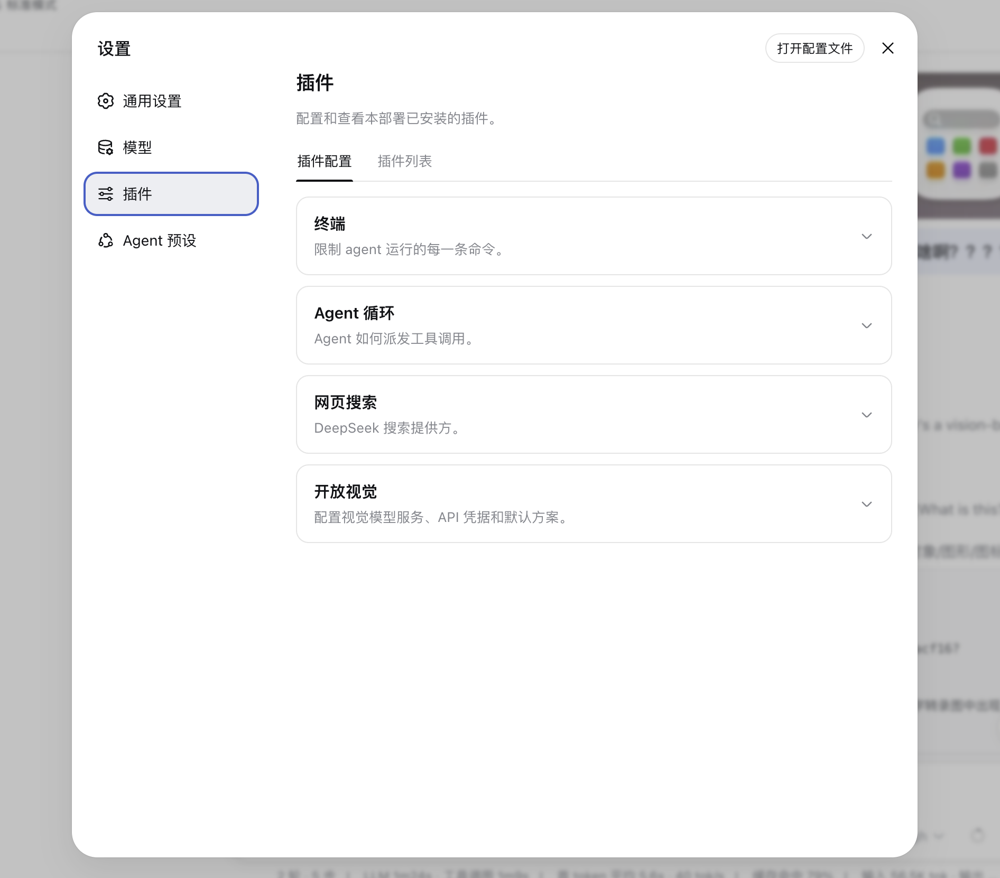
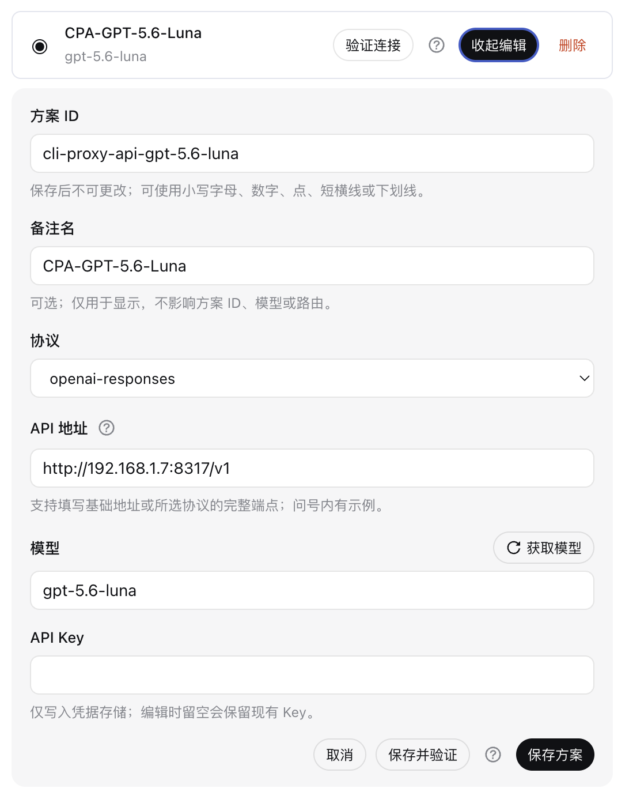
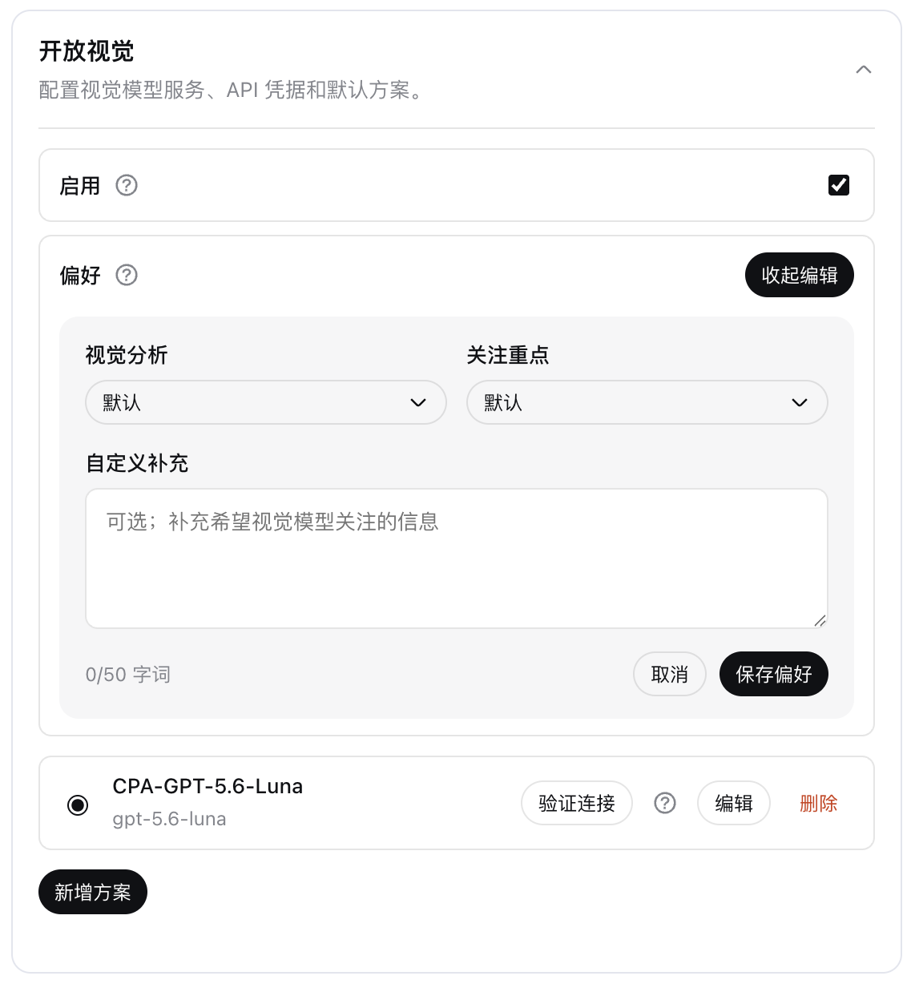
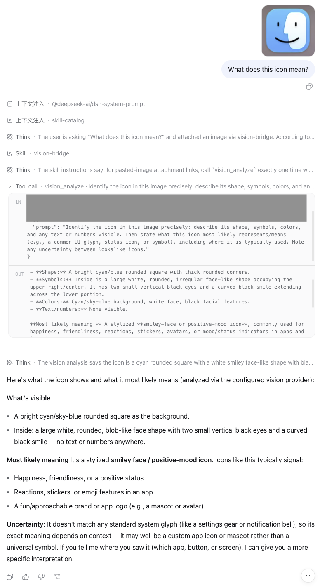

<p align="center">
  
</p>

<h1 align="center">dsh-open-eyes</h1>

<p align="center"><strong>让你选择的多模态模型，成为 DeepSeek 的眼睛。</strong></p>

<p align="center"><a href="./README.md">English</a> · 中文</p>

`dsh-open-eyes` 为 DeepSeek Harness 提供可自由配置的视觉能力。向对话发送截图、照片、图表或界面后，主模型可以把视觉任务交给你选择的多模态模型，再在同一个对话中使用返回的文字分析。因此，主模型本身不需要原生支持图片。

Open Eyes 支持 OpenAI Responses、OpenAI Chat Completions 和 Anthropic Messages 接口。插件不绑定任何特定厂商：API 地址、模型和凭据都由用户自行选择。

> **非官方社区插件：**`dsh-open-eyes` 是独立的社区项目，与 DeepSeek 无隶属关系，也未经 DeepSeek 官方背书或维护。

## 安装

需要 Node.js `>=22.19.0`。Open Eyes 与 DSH 采用严格一对一兼容关系，不向前兼容，也不向后兼容。

| DeepSeek Harness 版本 | 安装指令 |
| --- | --- |
| `0.1.0-rc.6` | `dsh plugin --profile web add dsh-open-eyes@0.1.0` |
| `0.1.1-rc.2` | `dsh plugin --profile web add dsh-open-eyes@0.1.1-rc.2` |
| `0.1.2-alpha.1` | `dsh plugin --profile web add dsh-open-eyes@0.1.2-alpha.1` |
| `0.1.2-rc.1` | `dsh plugin --profile web add dsh-open-eyes@0.1.2-rc.1` |

安装后重启 DSH Web，并刷新页面。不同 DSH profile 相互独立，需要在每个希望使用 Open Eyes 的 profile 中分别安装。

## 在设置中找到开放视觉

打开 **设置 → 插件 → 插件配置（Settings → Plugins → Plugin configuration）**，展开 **开放视觉（Open Eyes）**。插件会根据 DSH 当前界面语言显示中文名“开放视觉”或英文名“Open Eyes”。

<p align="center">
  
</p>

## 配置自己的视觉模型

Open Eyes 支持创建多个视觉方案，并可随时切换当前默认方案。每个方案都可以填写可选备注名、API 地址、模型和 API Key。API 地址既可以是服务基础地址，也可以是所选协议的完整端点。

目前支持三种协议：

- `openai-responses`
- `openai-chat-completions`
- `anthropic-messages`

模型名称可以手动填写，也可以点击**获取模型**读取服务提供的模型列表。模型目录通常不会可靠标注图片能力，因此仍需自行确认所选模型支持多模态。**验证连接**会使用当前真实配置发送一张极小的测试图片；**保存并验证**可以在新增或编辑方案后立即完成检查。

<p align="center">
  
</p>

折叠后的方案列表只显示备注名和模型名。左侧单选圆圈用于选择默认方案；编辑表单会直接出现在对应方案下方，再次点击同一个按钮即可收起。验证结果不会撑大或改变方案卡片的布局。

API Key 只会通过 DSH Credentials 写入凭据存储，不会进入插件 Settings 或 `cordis.patch.yml`。编辑已有方案时留空即可保留原 Key。删除方案不会自动删除已保存的凭据。

## 决定何时启用开放视觉

顶部的**启用**开关只对新会话生效：

- 在 Open Eyes 启用时创建的会话，所有 Web 图片都会进入开放视觉工作流。
- 在 Open Eyes 禁用时创建的会话，图片完全交还 DSH 原生处理。
- 已有会话始终保留创建时的状态，之后反复切换开关也不会改变它。

切换默认视觉方案不需要新建会话。同一会话中的下一次视觉分析会直接使用新选中的方案。

## 定制视觉分析偏好

对话模型会根据用户的问题自行生成有针对性的 `vision_analyze` Prompt，例如准确抄录错误信息、检查界面布局、读取图表或比较两张截图。可选的**偏好**区域让用户在此基础上进一步控制视觉模型：

- **视觉分析：**默认、效率优先或深入分析。
- **关注重点：**文字与 OCR、表格与图表、界面与布局、物体与场景、异常与细节。
- **自定义补充：**最多 50 个字词单位的个性化说明。

<p align="center">
  
</p>

偏好会在可见 Tool Call 之后、真正请求视觉模型之前，由 Open Eyes 在内部追加。因此，额外偏好不会显示在 Tool Call 参数中，也不会修改主模型的 System Prompt、对话历史、工具声明或 Harness Loop。所有选项保持**默认**时不会增加任何内容，视觉 Provider 收到的仍是原始任务 Prompt。

偏好修改后会从下一次视觉分析开始生效，包括同一个已有会话中的后续调用。

## 开始使用

在 DSH Web 中粘贴、拖入或选择图片，写下真正想问的问题，然后正常发送即可。Open Eyes 会保留用户原文，为视觉工具提供只属于当前会话的附件引用，并把视觉模型返回的分析交给主模型继续回答。

下面的案例中，非多模态主模型 **GLM-5.3（High effort）** 收到一张图片后调用 `vision_analyze`，把图片交给 **GPT-5.6-Luna** 分析，并在最终回答中使用返回的视觉证据。

<p align="center">
  
</p>

同一个工具也可以分析 Agent 已经可以访问的本地图片：

```text
请调用 vision_analyze，读取 screenshots/error.png 中的错误提示，
准确抄录错误码，并说明当前界面中可以看到哪些操作。
```

本地图片支持 PNG、JPEG、WebP 和 GIF。相对路径以当前 Agent session 工作目录为准。远程图片 URL 默认关闭，确实需要时可以通过高级配置启用。

## 工作流程

1. 用户发送图片并提出普通问题。
2. 对话模型把问题整理成具体的视觉任务。
3. Open Eyes 追加用户保存的偏好，把图片交给所选多模态 Provider。
4. 视觉分析作为非可信证据返回，由对话模型理解并组织最终回答。

每次分析都会重新读取当前默认视觉方案和视觉偏好，因此这两项可以实时更改，不需要重建对话。启用状态则在会话创建时固定，避免反复切换开关改变该会话对模型可见的 Prompt 或工具目录。

## 高级配置与 headless 使用

设置卡片已经覆盖大多数用户需要的字段。请求限制、重试、自定义 Header、认证覆盖、远程 URL 和文件系统策略等高级配置仍保留在 `cordis.patch.yml` 中；通过设置编辑方案时，这些未展示字段不会丢失。

<details>
<summary>最小高级配置示例</summary>

```yaml
- id: vision-bridge
  config:
    enabled: true
    visualAnalysis: default
    focusAreas: []
    preference: ''
    providers:
      - id: my-vision
        protocol: openai-chat-completions
        baseUrl: https://api.example.com/v1
        model: your-vision-model
        credential: VISION_PROVIDER_API_KEY
        maxOutputTokens: 2048
        chatMaxTokensField: max_completion_tokens
    defaultProvider: my-vision
```

请把 `VISION_PROVIDER_API_KEY` 保存到 DSH 使用的 Credential 来源中，配置文件只保留引用名称。

若要在 headless profile 中使用，把安装和检查命令中的 `web` 替换成目标 profile。`vision_analyze` 工具和内置 `vision-bridge` Skill 仍然可用，只是不显示 Web 设置卡片。

</details>

## 隐私与安全

- 通过 Open Eyes 处理的图片会发送给用户配置的第三方 Provider。使用前应确认对方的隐私、数据保留和计费规则。
- Credential 在每次请求时通过 DSH Credential Reference 解析。Tool 参数和浏览器插件请求都不接受 API Key 明文。
- 本地文件默认不能越出 Agent workspace 和明确允许的目录；上传前会校验图片内容。
- 远程图片 URL 默认关闭。启用后由视觉 Provider 获取 URL，Open Eyes 不会先在本地下载。
- 视觉模型输出只作为非可信证据，不应被当作需要执行的指令。

## 可靠性与兼容性

- 每个 Open Eyes 版本仅面向安装表中对应的 DeepSeek Harness 精确版本设计并完成验证，不兼容更早或更晚的 DSH 版本。
- 纯文本发送和禁用状态的会话继续使用原始 DSH 提交链路。
- Web 包装层完整保留提交结果、取消信号、异常和草稿图片。
- 获取模型、连接验证和视觉推理会对有界的短暂网络故障、超时、响应体中断、限流和网关异常进行恢复。默认每次尝试最长五分钟，最多重试两次。

认证错误、请求参数错误、协议错误和用户取消不会重试。极少数情况下，上游已经接收请求后连接才中断，恢复重试可能产生重复用量或计费。

## 故障排查

- **设置中看不到开放视觉：**确认插件安装在当前运行的同一个 profile，重启 DSH Web 并刷新页面。
- **新会话走了错误链路：**检查启用开关后重新创建会话；已有会话会保留创建时状态。
- **验证连接失败：**依次检查协议、地址结尾、模型、API Key、DNS、端口、TLS、账户配额和服务状态。验证提示会尽可能区分这些情况。
- **获取模型为空：**继续手动填写模型，并自行确认它支持图片。
- **出现 `VISION_NOT_CONFIGURED`：**至少新增一个方案并选择有效默认方案。

检查当前 profile：

```sh
dsh --profile web --dump-config
```

## 卸载

```sh
dsh plugin --profile web remove dsh-open-eyes
```

随后重启 DSH Web 并刷新页面。如果曾经手动添加过 `vision-bridge` 或 `vision-bridge-skill` row，只删除这些 row，并保留所有无关 profile 配置。

## 开发

```sh
corepack enable
pnpm install --frozen-lockfile
pnpm run typecheck
pnpm run lint
pnpm run test
pnpm run build
npm pack --dry-run
pnpm run test:e2e
```

测试不需要付费视觉 API。打包 E2E 会在临时 DSH profile 中安装、启动并移除真实 tarball。

## 许可证

项目使用 [MIT License](./LICENSE)。安全问题请按照[安全策略](https://github.com/Hyp6666/dsh-open-eyes/blob/main/SECURITY.md)私下报告。
